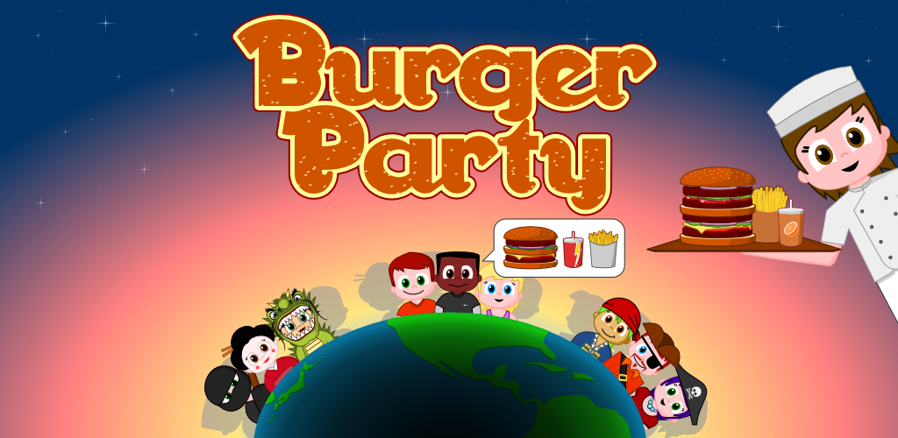
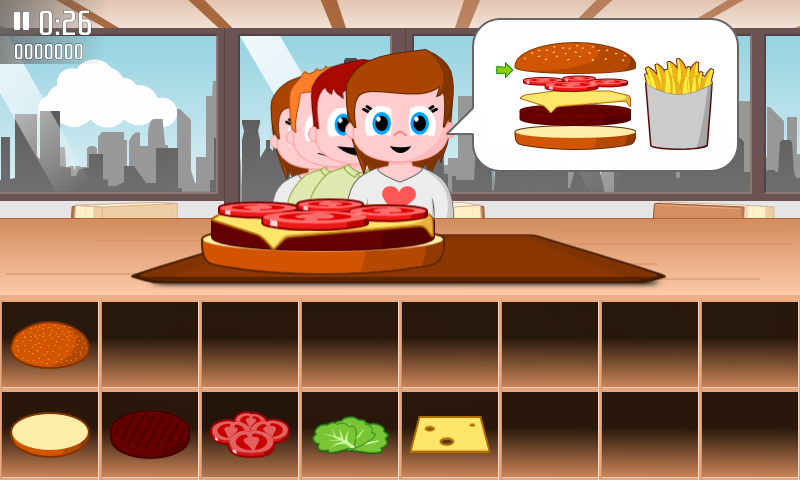

# Burger Party

Burger Party is a time management game for Android where you play a fast-food
owner who must put together the burgers ordered by her customers before time
runs out.

Are you fast enough to keep all your customers happy, unlock all worlds, all
ingredients and all the achievements?

## SwitchGDX
The [SwitchGDX](https://github.com/TheLogicMaster/switch-gdx) backend enables support for more portable
target platforms by transpiling to C++ using [Clearwing VM](https://github.com/TheLogicMaster/clearwing-vm).
The primary target is a Nintendo Switch Homebrew application.

### Windows
- Install MSYS2
- Open a mingw64 shell: `C:\msys64\msys2_shell.cmd -mingw64`
- Install dependencies: `pacman -S gcc git rsync texinfo mingw-w64-x86_64-cmake mingw-w64-x86_64-zziplib mingw-w64-x86_64-glew mingw-w64-x86_64-SDL2_mixer mingw-w64-x86_64-freetype mingw-w64-x86_64-bullet`
- Install [devkitPro Updater](https://github.com/devkitPro/installer/releases/latest) with Switch packages selected (Leave downloaded files)
- Open DevKitPro's MSYS2: `C:\devkitPro\msys2\msys2_shell.cmd -mingw64`
- Install dependencies: `pacman -S switch-zlib switch-zziplib switch-sdl2_mixer switch-libvorbis switch-freetype switch-glad switch-curl dkp-toolchain-vars texinfo`
- Build LibFFI for Switch

### Linux
- Install CMake, Ninja, Rsync, Texinfo, SDL2, SDL2_Mixer, GLEW, libffi, zlib, zziplib, freetype
- With APT: `sudo apt install build-essential texinfo rsync cmake ninja-build libffi-dev libzzip-dev libsdl2-dev libsdl2-mixer-dev zlib1g-dev libglew-dev libfreetype-dev libcurl4-gnutls-dev`
- Install [devkitPro pacman](https://github.com/devkitPro/pacman/releases/tag/v1.0.2)
- `dkp-pacman -S switch-zlib switch-sdl2 switch-sdl2_mixer switch-freetype switch-glad switch-curl switch-bulletphysics dkp-toolchain-vars`
- Build LibFFI for Switch

### Switch Homebrew
- The `NRO` task builds a Homebrew application
- The `Deploy` task uses NXLink to deploy to a Switch running the Homebrew Launcher

### UWP
- Install CMake for Windows
- Install Visual Studio 2022 and C++/UWP support (`Desktop development with C++`, `Windows application development`)
- Run twice for DLLs to properly be copied for some reason

## Where do I get it?

You can find binaries on the [game page][gp].

[gp]: http://agateau.com/projects/burgerparty

## What about other platforms?

Burger Party is primarily designed for mobile. It has only been tested on
Android, but since it has been built using [libgdx][] it should be doable to
make it work on iOS and on the web. Pull requests are welcome!

[libgdx]: https://libgdx.badlogicgames.com

You can also build and run it on Linux, macOS and Windows. It's just not much
fun unless you have a touch screen (or you are really fast and precise with
your mouse!)

## License

- All the code is licensed under GPL 3.0 or later, except for the more reusable
  code of the [com.agateau.burgerparty.utils][utils] package, which is licensed
  under Apache 2.0.
- Licenses for assets are detailed in [doc/assets.md](doc/assets.md).

The rational behind this is to:

- allow reuse of all the code and assets by free software projects.
- allow reuse of utility code in proprietary projects.
- prevent ad-based, proprietary clones of the game.

Put another way, if you are a game developer and find some of the code
interesting, feel free to use it to build your *own* original project. If you
are interested in some of the GPL code, get in touch: I am open to relicensing.

On the other hand, if your plan is to take the game, slap some ads on it, and
release it without releasing the sources of your changes: the license forbids
you to do so, go find another prey.

[utils]: core/src/com/agateau/burgerparty/utils

## Goodies

You can find T-shirt and other Burger Party goodies [here][goodies].

[goodies]: http://agateau.com/redirect/bp-goodies
